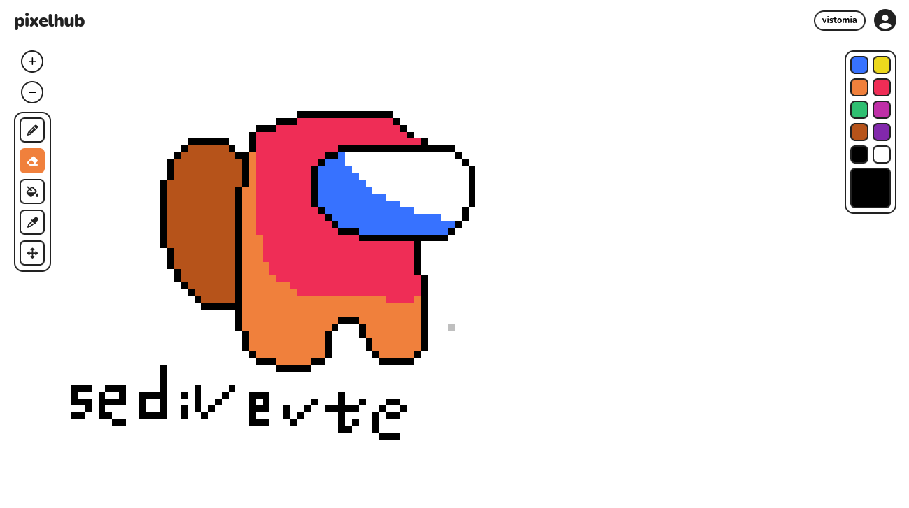

# PixelHub

32 número da lista

Victor Farias e Emanuel Araújo

## Aplicação

*não é uma imagem ilustrativa*

Mural de Pixel Art Colaborativo.

## Como Executar?

Use o liveserver no index.html
- fiz um backend bem mais ou menos só para ver se o websocket tava funcionando:
``node main.js``

### Superclasse

Ferramenta (representa uma ferramenta que o usuário pode selecionar para interagir com o mural)

### Subclasses

De Ferramenta: Pincel, Borracha, BaldeDeTinta

---
Agregação -> Mural, que conterá uma matriz de Pixels
Interface -> Desenha que define uma operação como desenhar.

## Fluxo principal

Toda aplicação vai usar WebSocket.

1. Cliente conectado recebe uma imagem.png de todo o mapa 1000x1000

2. Cliente recebe alterações da imagem pelo servidor, por hora será um vetor:
`[cor, x, y]`

3. Cliente desenhando acumula mudanças por 200ms em no buffer (vetor) e envia para o servidor.

4. Servidor processa as mudanças dos usuários em um único vetor.

5. Servidor dispara em broadcast as mudanças.

5. Servidor atualiza a imagem.png.

---

Casos de erro

Caso o usuário não consiga enviar o buffer ele recebe um rollback de suas mudanças e um aviso.

## TODO Front

- [x] Pencil
- [x] Eraser
- [x] Bucket
- [ ] Dropper
- [X] Pan
- [ ] Cursors
- [X] Pallete
- [ ] Botão de Zoom

## TODO Back

- [ ] Paint
- [ ] Bucket
